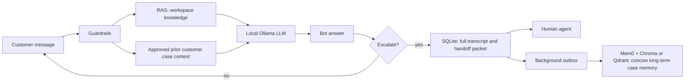

# Beginner Guide: RAG, AI Agents, Mem0, and Human Handoff

This guide explains the two support-bot demos in this workspace as if you are starting from zero. Read it once, then keep the Mem0 demo open at `http://localhost:8503` while you repeat the examples.

## 1. The one-sentence mental model

An **LLM** writes the answer, **RAG** finds company knowledge for the answer, **memory** brings back approved customer-specific facts from previous sessions, and a **human agent** takes over when the bot should stop.



## 2. Core words you must know

| Word | Plain-English meaning | In this project |
|---|---|---|
| LLM | A text-prediction model that reads a prompt and writes a response. It does not remember a past session by itself. | Ollama `llama3.2:1b` writes open-ended support answers. |
| Prompt | All text given to the LLM for one response. | Support instructions + customer question + retrieved KB chunks + limited approved context. |
| Token | A small piece of text processed by the LLM. More tokens usually mean more latency/cost. | The app limits context and answer size. |
| Embedding | A list of numbers representing the meaning of text. | Ollama `nomic-embed-text` turns chunks, questions, and memories into vectors. |
| Vector | The numeric embedding itself. Similar meanings are placed close together in vector space. | Stored in SQLite for KB retrieval and in Chroma/Qdrant for Mem0. |
| Vector store | A database that finds vectors nearest to a query vector. | Chroma is default; Qdrant is an optional free alternative. |
| RAG | Retrieval-Augmented Generation: retrieve relevant documents, then give them to the LLM. | Finds workspace support policy chunks before an answer. |
| Chunk | A small piece of a large document. | PDFs, pasted policies, and web pages are split into approximately 700-character pieces. |
| Metadata/filter | Labels used to restrict search. | `workspace_id` and `user_id` prevent tenant/customer leakage. |
| Session | One current conversation. | Complete messages are retained in SQLite. |
| Long-term memory | Small, approved facts usable in future sessions. | Mem0 stores a concise case record, never the entire raw chat. |
| Agent | A program that uses an LLM plus state, rules, tools, and a goal. | The support bot is a constrained agent, not an unrestricted autonomous system. |
| Human handoff | Stop bot automation and give a person the context needed to continue. | The human receives goal, unresolved issue, facts, bot attempt, prior case context, and full transcript. |

## 3. LLMs are stateless

If you ask a normal LLM, “My bill was charged twice,” it can answer. If you return tomorrow, the LLM does not automatically know who you are or what happened yesterday. Each LLM request is independent unless your application sends previous context again.

There are three different ways to provide context. Do not confuse them:

1. **Current transcript** — recent messages in this chat. This is needed so “yes, that invoice” has meaning.
2. **RAG knowledge** — company documents that are shared by many customers, such as a billing policy.
3. **Customer memory** — durable, customer-specific facts across sessions, such as an unresolved duplicate-charge case.

Putting all three into one vector database causes noise and privacy problems. This demo keeps them separate on purpose.

## 4. How RAG works in the RAG-only demo

Repository: `rag-chatbot-without-mem0`.

### When knowledge is added

1. An administrator selects a workspace, such as `nayatel-demo`.
2. They paste policy text, upload a PDF, or add an allowed public website URL.
3. The application extracts text and divides it into chunks.
4. Each chunk is embedded once using `nomic-embed-text`.
5. The chunk text, vector, source name, and workspace ID are stored locally.

This is **indexing**. It can be slower because a document may have many chunks. You only need to do it again if the document changes.

### When a customer asks a question

1. Guardrails inspect the message first. Passwords, OTPs, CVVs, card-like numbers, and prompt-injection attempts are blocked.
2. The application knows the active workspace. It searches only that workspace's chunks.
3. A clear keyword match uses a fast path. An ambiguous question is also embedded and compared by meaning.
4. The top relevant chunks are passed to the local LLM.
5. The LLM writes an answer grounded in those chunks.
6. The screen shows `Sources used` and the retrieval evidence.

Example: the customer says “my payment showed twice,” while the policy says “duplicate charge.” Exact keyword search may miss it; semantic embeddings help connect the meanings.

## 5. What Mem0 adds

Repository: `rag-chatbot`.

Mem0 does **not** replace RAG. It adds a separate customer-memory layer.

At end of session or escalation, the application creates a short `SUPPORT MEMORY` candidate such as:

```text
Workspace: nayatel-demo
Customer: customer-001
Topic: billing or payment
Status: needs human review
Latest need: My invoice INV-42 appears twice.
Safe facts: Customer reports a duplicate charge.
Next action: human review.
```

Before saving it, the application checks that it is a durable support fact and does not contain secrets or transient small talk. The full transcript goes to SQLite, not Mem0.

The candidate is saved through a background outbox worker. This matters because local embedding/model work can be slow; the customer and agent should never wait for it.

On a new session, the application first gets immediate, workspace-and-customer-scoped continuity from SQLite. The durable semantic Mem0 record is additional long-term storage.

## 6. How human-agent handoff works

When the customer asks for an agent, or the bot cannot safely solve the issue:

1. The bot stops pretending it can resolve the case.
2. SQLite creates a handoff packet immediately.
3. The packet includes: customer goal, unresolved topics, customer facts, last bot attempt, relevant prior context, escalation reason, and full transcript.
4. The human agent sees this packet in the demo's **Human Agent Inbox**.
5. The agent can respond, then set an outcome:
   - **Resolved**: case is closed.
   - **Unresolved**: a follow-up is still required.
   - **Corrected**: an earlier memory was wrong; the agent writes the accurate final note.
6. The decision is recorded in SQLite's audit trail and queued to update the exact Mem0 record when its ID is known.

This is a critical rule: **human correction has higher authority than model-generated memory.** Otherwise the bot can keep repeating a wrong old fact.

## 7. Why two databases and two vector-store choices exist

| Store | Contains | Why it exists |
|---|---|---|
| SQLite transcript DB | Complete session messages, handoff packets, evidence, agent feedback | Auditability and instant reliable handoff. |
| SQLite KB vectors | Workspace knowledge chunks and their embeddings | Simple free RAG-only demo. |
| Chroma | Mem0 customer-memory vectors by default | Free embedded vector store; easiest local option. |
| Qdrant local | Optional Mem0 customer-memory vectors | Free open-source alternative, useful to demonstrate a more production-style vector engine. |

Use one vector store per purpose with mandatory metadata filtering. Never make one shared vector collection containing every client's documents, transcripts, and personal memories.

## 8. Files to read in this order

| File | What to learn from it |
|---|---|
| `app.py` | The user interface and end-to-end routing. |
| `guardrails.py` | What is blocked before LLM/RAG/memory. |
| `rag.py` | Chunk retrieval, hybrid keyword/semantic ranking, tenant filtering. |
| `kb_ingestion.py` | PDF/web/text ingestion and safe URL restrictions. |
| `llm_service.py` | Local Ollama prompt and fast deterministic workflows. |
| `support_history.py` | Transcript, handoff packet, memory admission, feedback lifecycle. |
| `memory_service.py` | Mem0 OSS, Chroma/Qdrant configuration, background outbox sync. |
| `eval_cases.json` | Repeatable scenarios to prove the design. |
| `NEGATIVE_TESTING.md` | Security, privacy, failure, and tenant-isolation tests. |

## 9. Your local setup: what is installed

Already installed or available locally:

- Python 3.14 and all packages from both repositories' `requirements.txt`.
- Streamlit for the browser demos.
- Ollama service.
- `llama3.2:1b` for answers.
- `nomic-embed-text` for embeddings.
- Mem0 OSS Python library.
- Chroma default storage and `qdrant-client` for embedded Qdrant.

No OpenAI key, Mem0 cloud key, Pinecone key, or paid vector-database account is required for these local demos.

### Run commands

```powershell
# Mem0 OSS demo
cd C:\Users\HP\Documents\Codex\2026-07-14\bu\work\rag-chatbot
streamlit run app.py --server.port 8503

# RAG-only comparison demo
cd C:\Users\HP\Documents\Codex\2026-07-14\bu\work\rag-chatbot-without-mem0
streamlit run app.py --server.port 8504

# Optional: use embedded free Qdrant for Mem0 rather than default Chroma
$env:MEM0_VECTOR_STORE = "qdrant-local"
streamlit run app.py --server.port 8503
```

## 10. A study plan that matches your project

### Week 1: understand the vocabulary

1. Read sections 1–5 of this guide.
2. Use the RAG-only demo. Add one small billing policy and ask five questions.
3. Open **Last RAG retrieval** after every question. Learn to distinguish a good retrieved source from a bad one.
4. Complete **OpenAI Academy: AI Foundations**, then **Agents and Workflows**. These are free and give a course-completion certificate when you sign in. [OpenAI Academy course information](https://help.openai.com/en/articles/20001270-openai-academy-courses)

### Week 2: learn agent and vector concepts

1. Complete Hugging Face's free **AI Agents Course**. It includes a free certification route after Unit 1, an assignment, and final challenge. [Hugging Face course](https://huggingface.co/learn/agents-course/en/unit0/introduction)
2. Study embedding/vector concepts with the Qdrant documentation, then take the Qdrant developer certification quiz. [Qdrant training and certification](https://train.qdrant.dev/)
3. Run this demo once with Chroma, then once with `qdrant-local`; compare only storage behavior, not customer answers.

### Week 3: show enterprise judgment

1. Complete IBM SkillsBuild's AI Fundamentals / Generative AI path. It is free and offers shareable credentials on successful completion. [IBM SkillsBuild AI learning](https://skillsbuild.org/adult-learners/explore-learning/artificial-intelligence)
2. Run every case in `eval_cases.json` and record pass/fail evidence.
3. Run `py -3.14 -m pytest -q` in both repositories.
4. Present both demos side-by-side: RAG-only versus RAG + Mem0 + agent feedback.

## 11. A safe demonstration script

1. Select **Nayatel / Billing / customer-001**.
2. Add a support-policy document with duplicate-charge guidance.
3. Ask: `How can I pay my bill?` Show the source evidence.
4. Ask: `My invoice INV-42 appeared twice.` Show the fast/safe billing workflow.
5. Ask for a human agent. Show the exact agent packet and full transcript.
6. In the Human Agent Inbox choose **Corrected** and write: `Bank reversal, not a duplicate charge.`
7. Start another session as the same customer. Show returning customer context.
8. Switch to another customer or Shifa workspace. Show no Nayatel knowledge/memory leakage.
9. Ask for the system prompt or send an OTP. Show that guardrails block it and it is not saved as memory.

## 12. What this demo does not claim

- It is not a production healthcare decision system.
- It does not authenticate real users; the typed customer ID is a demo convenience.
- It does not replace a CRM/case-management system.
- It does not make a human agent unnecessary.
- It has local data only; production needs real RBAC, consent, deletion, retention, encryption, monitoring, a managed queue, and load testing.

## 13. The final takeaway

RAG answers “**What does this client's approved knowledge say?**”

Memory answers “**What approved, customer-specific context should we carry into the next session?**”

Human handoff answers “**What does the person need to know to solve the case without asking the customer to repeat everything?**”

The demo is designed so each of those questions has its own storage, permissions, and evidence trail.
